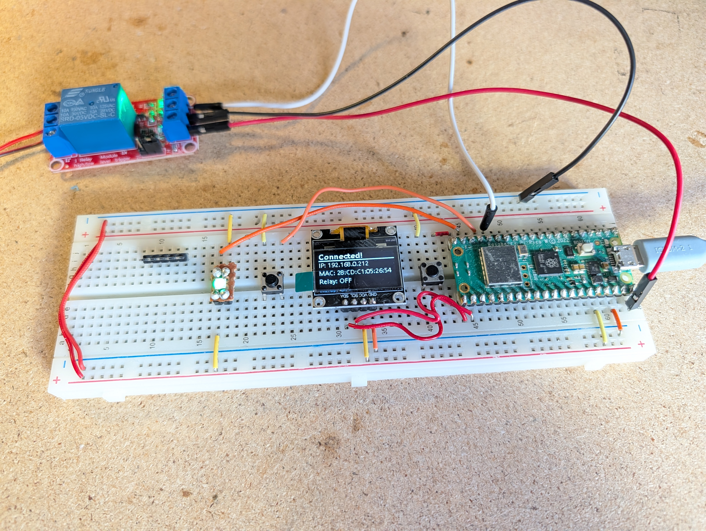
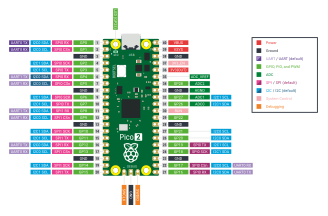

# WLAN-RELAIS

Dieses Projekt ist ein WLAN-RELAIS-Schalter für den Raspberry Pi Pico W oder Pico 2 W. Es kann verwendet werden, um ein an ein Relais angeschlossenes Gerät ein- und auszuschalten, oder auch den Einschaltknopf eines PCs zu drücken.

Das Projekt basiert auf dem pico-sdk und den pico-examples. Das Projekt ist in C++ geschrieben und verwendet das pico-sdk für den Hardwarezugriff.


## Hardware
Der Aufbau besteht aus folgenden Komponenten:
- Raspberry Pi Pico W oder Pico 2 W
- OLED Display (basierend auf SSD1306, über I2C angeschlossen) 
- Relay Module (HW-803, 5V, 1 Kanal, optokoppler-gesteuert)
- RGB LED (programmierbare LED basierend auf WS2812B oder SK6812, über einen GPIO gesteuert)
- 2 x Mikro-Schalter oder andere Taster (für Reset und Relais Toggle)

Die RGB LED wird als Statusanzeige für die WLAN-Verbindung verwendet. Das OLED Display zeigt die aktuelle IP-Adresse an, sobald eine Verbindung zum WLAN hergestellt wurde. Das Relay Module kann über eine Web-API gesteuert werden, um ein angeschlossenes Gerät ein- oder auszuschalten.




### Pin-Belegung


| Pin | GPIO | Funktion |
| :--- | :--- | :--- |
| **16** | **GP12** | Relais |
| **17** | **GP13** | Relais-Toggle-Button |
| **19** | **GP14** | Status RGB Data |
| **20** | **GP15** | Reset-Button |
| **21** | **GP16** | I2C OLED-Display SDA |
| **22** | **GP17** | I2C OLED-Display SCL |
| **36** | **3.3V** | 3.3v Power for OLED-Display and RGB-LED |
| **40** | **VBUS 5V** | 5V from USB-Port for Relais |


## Firmware bauen und flashen

### Quellcode auschecken / updaten

Das Projekt enthält ein Submodule, daher beim auschecken mit "recursive" Option klonen:

    git clone --recurse-submodules https://github.com/pfedick/pico-wlan-relais.git

Falls das Projekt bereits geklont wurde, müssen die Submodule separat initialisiert und aktualisiert werden:

    git submodule init
    git submodule update

Bei dem Submodule handelt es sich um eine Library von mir namens "pico-pplib", die verschiedene Hilfsklassen für die Entwicklung mit dem pico-sdk enthält, z. B. für die Ansteuerung von WS2812B LEDs oder die Anbindung von SSD1306 OLED Displays. Der Quellcode dazu ist hier zu finden: https://github.com/pfedick/pico-pplib


### WLAN-Zugangsdaten konfigurieren
Lege im Hauptverzeichnis des Projekts eine Datei namens `.env` an, mit folgendem Inhalt:

```
WIFI_SSID=DeinWLANName
WIFI_PASSWORD=DeinWLANPasswort
```

SSID und Passwort entsprechend anpassen. Diese Datei wird von git ignoriert und wird nicht ins Repository aufgenommen, damit deine Zugangsdaten privat bleiben. Die Daten werden aber beim Kompilieren in die Firmware eingebunden, damit sich der Pico mit deinem WLAN verbinden kann.

### Kompilieren und Flashen

Kompilieren mit:

    make

Dabei wird zuerst der Build mit cmake konfiguriert und dann die Firmware gebaut.

Sofern alles durchläuft, ist die Firmware danach im `build`-Ordner zu finden:

    build/wlanrelais.uf2

Sofern der Pico im USB-Boot-Modus angeschlossen ist, kann diese Datei auf das Laufwerk des Pico kopiert werden.

Im Makefile gibt es noch das Target "copy", was das automatisch versucht, allerdings nur auf meinem Rechner ;-) => Gerne besser machen!

    make all copy

Um den Pico in den Programmiermodus zu versetzen, muss der Reset-Knopf länger als 1 Sekunde gedrückt gehalten werden. Alternativ den weißen Knopf auf der Platine des Pico gedrückt halten, während der USB-Stecker angeschlossen wird.


## Web-API

Nachdem sich der Pico mit dem WLAN verbunden hat, zeigt er im Display sein IP-Adresse an. Über diese IP-Adresse kann die Web-API erreicht werden, um das Relais zu steuern.

Die IP-Adresse erhält er über DHCP von deinem Router. In der Regel ist das eine dynamische Adresse, die sich ändern kann. Anhand der MAC-Adresse des Pico, die ebenfalls im Display angezeigt wird, könntest Du Deinen Router aber auch so konfigurieren, dass er dafür eine feste IP-Adersse vergibt.


### API-Endpunkte
| Endpunkt | Methode | Beschreibung |
| :--- | :--- | :--- |
| `/` | GET | Zeigt eine einfache HTML-Seite mit Informationen zum Gerät und Links zu den Relais-Steuerungsendpunkten an |
| `/on` | GET | Schaltet das Relais ein |
| `/off` | GET | Schaltet das Relais aus |
| `/toggle` | GET | Wechselt den Zustand des Relais (ein -> aus, aus -> ein) |
| `/pulse` | GET | Schaltet das Relais für 500 Millisikunden ein und dann wieder aus. |
 | `/pulse?l=xxxx` | GET | Optional, kann die Dauer, die das Relais eingeschaltet werden soll, bevor es wieder ausgeht, über den Parameter "-l=xxxx" angegeben werden, wobei xxxx die Dauer in Millisekunden angibt. |
| `/status` | GET | Gibt den aktuellen Status des Relais zurück (JSON: `{ "relais": "on" }` oder `{ "relais": "off" }`) |

Um die API anzusteuern kann zum Beispiel ein Browser oder ein Tool wie `curl` verwendet werden. Beispiel:

    curl http://<IP-ADRESSE-DES-PICO>/toggle

Oder im Browser:

    http://<IP-ADRESSE-DES-PICO>/toggle

Wichtig: Der Pico unterstützt nur HTTP, kein HTTPS. Daher muss die Verbindung unverschlüsselt erfolgen.

Python:
```python
import requests

response = requests.get("http://<IP-ADRESSE-DES-PICO>/toggle")
print(response.status_code)
print(response.text)
```


## Weitere Funktionen
- **Reset-Knopf**: Bei kurzen Druck (weniger als 1 Sekunden) wird ein Neustart durchgeführt. Bei langem Druck (länger als 1 Sekunde) wird der Pico in den USB-Boot-Modus versetzt, um die Firmware zu aktualisieren.
- **Relais-Toggle-Knopf**: Wechselt den Zustand des Relais (ein -> aus, aus -> ein).
